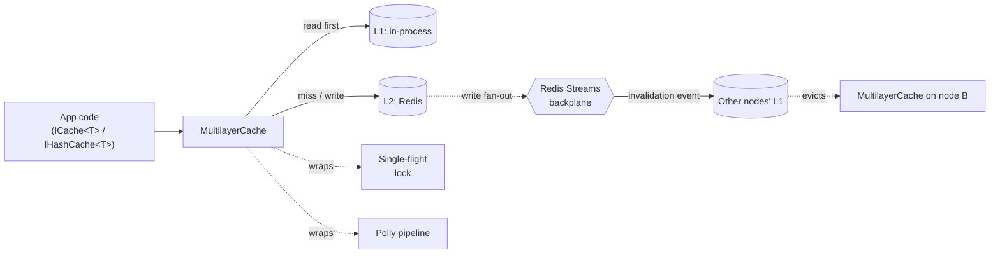

# UiPath Platform Caching

Multilayer caching for .NET — L1 in-memory + L2 Redis, cross-node sync over Redis Streams, single-flight stampede protection, hydrating cache, and CloudEvents — behind a small, opinionated DI surface.

[](https://github.com/UiPath/dotnet-caching/actions/workflows/ci.yml) [](#requirements) [](LICENSE)

The library powers caching in UiPath Platform services. It is built for multi-tenant workloads that need a hot in-process tier, a shared Redis tier, and cross-node coherence — without each service reinventing the same patterns.

## Quick Start

```bash
dotnet add package UiPath.Caching
dotnet add package UiPath.Caching.Polly
dotnet add package UiPath.Caching.CloudEvents
```

Wire it once in `Program.cs`:

```csharp
using UiPath.Caching;
using UiPath.Caching.CloudEvents;
using UiPath.Caching.Config;
using UiPath.Caching.Polly;

var section = builder.Configuration.GetSection("Caching");
builder.Services.AddCaching(
    section,
    b => b.AddRedisConnection().AddBroadcast()
          .AddRedis().AddInMemoryRedis().AddMemory()
          .AddResilienceStrategies().AddCloudEvents(),
    o => { section.Bind(o); o.AppShortName = "my-service"; });
```

Inject and call:

```csharp
public class UserService(ICache<User> cache, IUserRepository repo)
{
    public ValueTask<User?> GetAsync(int id, CancellationToken ct) =>
        cache.GetOrAddAsync(id.ToString(), c => repo.LoadAsync(id, c),
                            TimeSpan.FromMinutes(5), ct);
}
```

Minimum `appsettings.json`:

```json
{
  "Caching": {
    "AppShortName": "my-service",
    "Connections": {
      "Redis": { "ConnectionString": "localhost:6379" }
    }
  }
}
```

That's it. Everything else has a sensible default. Five-minute onboarding lives in [docs/quickstart.md](docs/quickstart.md); the full settings reference is in [docs/reference/settings.md](docs/reference/settings.md).

## Features

**Resiliency**
- **Single-flight stampede protection** — one factory runs per key on a cache miss; other callers coalesce. In-process via `ILocalLock` (default on); cross-node via `IDistributedLock` (`AddInMemoryRedis()` registers the impl automatically — opt in with `DistributedLockEnabled: true`; `AddMemory()`-only or custom wiring needs an explicit `.AddRedisDistributedLock()`).
- **Hydrating cache** — proactive background refresh before a key expires (`CachePolicy.RehydrateEnabled` + `RehydrateOptions`). Avoids the expiry-miss path on hot keys so reads against still-live entries don't pay the factory cost. First-time misses still run the factory on the foreground caller.
- **Polly pipelines** — retry + circuit-breaker around every cache op (`AddResilienceStrategies`). Configurable per-op timeout, break duration, and rethrow behavior.
- **Connection-aware L1 fallback** — `UseLocalOnlyWhenDisconnected` + `LocalMaxExpirationDisconnected` keep the cache useful when Redis blips.

**Distribution**
- **Multilayer L1 + L2** — in-process MemoryCache + Redis, written together, read L1-first. Different TTLs per tier.
- **Redis Streams backplane** — durable, at-least-once cross-node L1 invalidation with consumer groups and replay. Fallback to Pub/Sub if you don't need durability.
- **Per-topic options** — fine-grained overrides for fan-out, polling, backpressure, and the streams notify doorbell.
- **Sharded Pub/Sub doorbell** (Redis 7+) — `NotifyEnabled` + `NotifyShardedPubSub` drop publish-to-deliver latency from `PollInterval` to network RTT without leaving the shard.
- **Redis Cluster aware** — shard-key routing, master/replica split (writes to master, reads from replicas).

**Advanced**
- **`IHashCache<T>`** — one entry, many fields, one TTL. Subset reads via `HMGET`; side-channel metadata via `HashCacheEntryOptions`. Bundled `GET + TTL` in a single transaction for hydrating-cache math.
- **Named cache policies** — per-`ICache<T>` settings keyed by `typeof(T).FullName` (TTLs, jitter, rehydration, lock profile). Inherits from `DefaultCachePolicy` with `null`-means-inherit semantics.
- **L2 jitter** — `JitterMaxDuration` spreads cluster-wide expirations after bulk writes.
- **Large-value auditing** — `AuditEnabled` + `LargeValueThreshold` log writes over a byte threshold.

**Observability**
- **`ICachingTelemetryProvider`** seam with span-based tag bags (allocation-free when telemetry is off). An OpenTelemetry adapter (`ActivitySource` + `Meter`) ships as `UiPath.Caching.OpenTelemetry`; OpenTelemetry Redis instrumentation wires up via the `IConnectionMultiplexerFactory` hook (see the sample).
- **CloudEvents** — broadcast events wrapped in the CNCF CloudEvents envelope (`UiPath.Caching.CloudEvents`).

## Architecture



`InMemoryRedis` is the default provider — multilayer with the backplane wired. `Redis` (L2-only) and `InMemory` (L1-only, optional broadcast) are available for single-tier scenarios. See [docs/concepts.md](docs/concepts.md) for the full mental model.

## Packages

| Package | When you need it |
|---|---|
| `UiPath.Caching.Abstractions` | Always (transitive). |
| `UiPath.Caching` | Always — providers, topics, locks. |
| `UiPath.Caching.Polly` | Resilience pipelines. Recommended. |
| `UiPath.Caching.CloudEvents` | CloudEvents envelope for broadcast events. Recommended. |
| `UiPath.Caching.Queue` | Redis set ("queue") support — `ISetCache` / `AddRedisSetCache`. |

## Documentation

| Topic | Doc |
|---|---|
| 5-minute onboarding | [docs/quickstart.md](docs/quickstart.md) |
| Architecture & mental model | [docs/concepts.md](docs/concepts.md) |
| Resilience (single-flight, hydrating, jitter, Polly) | [docs/how-to/resilience.md](docs/how-to/resilience.md) |
| Broadcast (per-topic, notify doorbell, sharded Pub/Sub) | [docs/how-to/broadcast.md](docs/how-to/broadcast.md) |
| Hash cache (metadata, bundled GET+TTL) | [docs/how-to/hash-cache.md](docs/how-to/hash-cache.md) |
| Telemetry + custom strategies | [docs/how-to/telemetry-and-strategies.md](docs/how-to/telemetry-and-strategies.md) |
| Short copy-paste patterns | [docs/recipes/](docs/recipes/) |
| Settings reference (every option, every default) | [docs/reference/settings.md](docs/reference/settings.md) |
| Public interface surface | [docs/reference/interfaces.md](docs/reference/interfaces.md) |
| Glossary | [docs/reference/glossary.md](docs/reference/glossary.md) |
| Sample app (Aspire AppHost) | [docs/sample-app.md](docs/sample-app.md) |
| Changelog | [CHANGELOG.md](CHANGELOG.md) |

## Requirements

- **.NET** — 8.0 and 10.0.
- **Redis** — 6.0+. Redis 7.0+ required for sharded Pub/Sub (`SPUBLISH`/`SSUBSCRIBE`) on the streams notify doorbell.
- **StackExchange.Redis** — pulled transitively; no direct dependency needed in consumers.

## License

[MIT](LICENSE).
